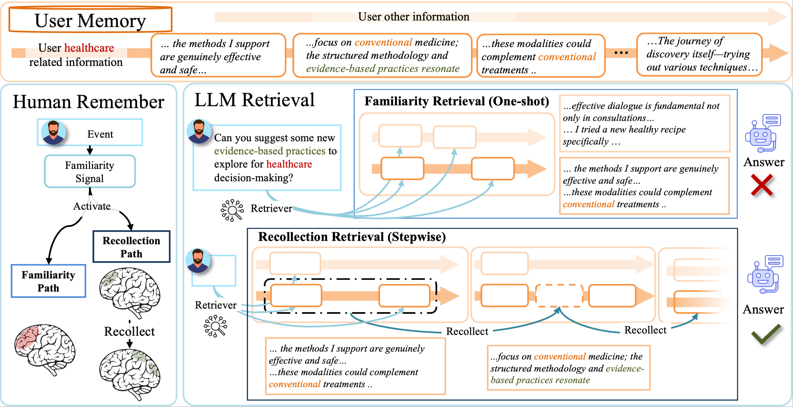
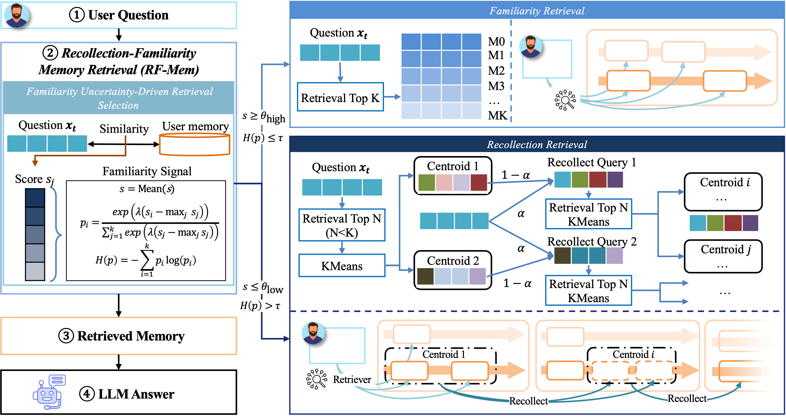

# Evoking User Memory: Personalizing LLM via Recollection-Familiarity Adaptive Retrieval

This repository contains the code and resources for the ICLR 2026 paper titled "Evoking User Memory: Personalizing LLM via Recollection-Familiarity Adaptive Retrieval". 

The origin code of submission can be found here: https://openreview.net/attachment?id=f7p0F2X6XN&name=supplementary_material.


## 🧠 RF-Mem

RF-Mem (**Recollection–Familiarity Memory**) is an adaptive retrieval framework for Large Language Models, grounded in the **dual-process theory of human cognition**.  
In cognitive science, memory is often described as a combination of two systems:  

- **Familiarity** – fast, effortless recognition that something has been seen before.  
- **Recollection** – slower, deliberate reconstruction of episodic details such as time, place, and context.  

This theory motivates RF-Mem: instead of treating retrieval as either one-shot search or full-context prompting, RF-Mem adaptively balances the two.  




## 📊 Framework Overview
The RF-Mem framework first measures retrieval uncertainty using mean similarity and entropy.  
- If ths system feel familiarity, it selects the **Familiarity path** for direct retrieval.  
- If this system feel unfamiliar, it switches to the **Recollection path**, where memory items are clustered and iteratively expanded with query reformulation.  

This dual-path design enables scalable and efficient personalized memory retrieval, improving both accuracy and efficiency across long-term memory benchmarks such as PersonaBench, PersonaMem, and LongMemEval.



---


## 📂 Project Structure

```
RF_mem
├──LongMemEval/.                # LongMemEval experiment data and scripts
│   ├──  assets/                # Figures of this paper
│   ├──  data/                  # Shared data directory
│   ├──  LICENSE
│   ├──  README.md              # Project description
│   ├──  requirements-full.txt  # Full dependencies
│   ├──  requirements-lite.txt  # Lightweight dependencies
│   ├──  run.sh                 # Quick start script
│
├── personabench_data/          # PersonaBench experiment data and scripts
│   ├── eval_data/              # Evaluation data
│   ├── llm_model/              # LLM model wrapper
│   ├── retri_mdoel/            # Retrieval model
│   ├── eval.py                 # PersonaBench evaluation entry
│   ├── main_batch.py           # Batch experiment entry
│   ├── run.sh                  # Quick run script
│   └── utils.py                # Utility functions
│
└── personamem_data/            # PersonaMem experiment data and scripts
    ├── apitokens/              # API key configuration
    ├── data/                   # Data directory
    ├── llm_model/              # LLM model wrapper
    ├── retri_mdoel/            # Retrieval model
    ├── main_batch.py           # PersonaMem batch experiment entry
    ├── run.sh                  # Quick run script
    └── utils.py                # Utility functions
```

---

## 🔧 Installation

It is recommended to use Python 3.10+.
   ```bash
   pip install -r requirements.txt
   ```


---

## 🚀 Usage


1. **Run LongMemEval experiments**
   ```bash
   cd LongMemEval
   bash run.sh
   ```


2. **Run PersonaBench experiments**
   ```bash
   cd personabench_data
   bash run.sh
   ```

3. **Run PersonaMem experiments**
   ```bash
   cd personamem_data
   bash run.sh
   ```

---

## 📜 License

This project is licensed under the [MIT License](LICENSE).

---

## ✨ Acknowledgements

- Authors of LongMemEval, PersonaBench & PersonaMem datasets  
- OpenAI / HuggingFace model community  
